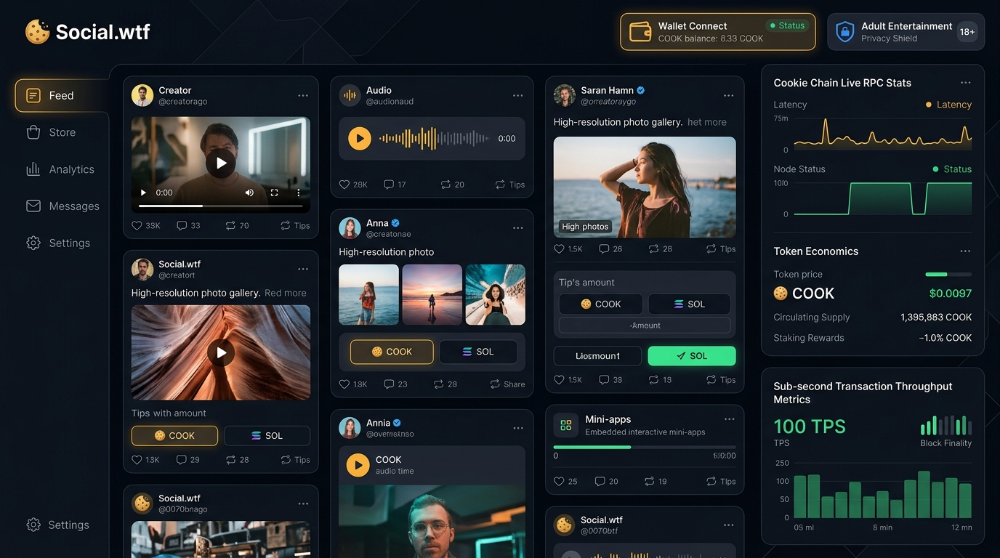

# Social.wtf

**A Unified Decentralized Web3 Social Ecosystem and Creator Storefront Hub on Cookie Chain (SVM)**

Social.wtf is a decentralized Web3 social platform built natively for the **[Cookie Chain](https://www.cookiechain.wtf)**. It consolidates micro-blogging, video streaming, music hubs, and creator storefronts into a unified interface where every profile functions as a customizable mini-app.

Every economic transaction—from store purchases to tips and subscriptions—automatically routes a **5% protocol fee** to the platform treasury to fund ongoing platform innovation and validator grants. Sensitive or explicit content is continuously screened by real-time multimodal AI and completely shielded from unverified feeds with **zero traces or hints**, unlockable exclusively via ephemeral, zero-data age verification.

<div align="center">
  
</div>

---

## Core Pillars & Architecture

### 1. Multi-Format Social Stream & Creator Storefronts [IMPLEMENTED]
- **4 Native Formats**: Text micro-blogging, high-res photography galleries, HTML5 video streaming, and real-time audio playback with waveform visualizers.
- **Modular Creator Profile Mini-Apps**: Personal ecosystems featuring customizable widgets (audio spotlight, crowdfund tip goals, digital product showcases, and verified links).
- **Creator Storefronts**: Direct sale of digital goods (music stems, 3D assets, VIP access passes, presets) priced in native `$COOK`.

### 2. Automated 5% Protocol Fee Split on Cookie Chain SVM [IMPLEMENTED]
- Built directly into atomic Solana Virtual Machine transactions and Rust Anchor contracts (`contracts/social_wtf/src/lib.rs`).
- Every transaction splits proceeds seamlessly:
  - **95%** routed directly to the creator's wallet.
  - **5%** automatically cut to the Social.wtf Platform Treasury (`HMnySuX1CdBfqysiLtU4brPawufcHxFTFZu97jrKQwT9`).
  - Immutable on-chain memo logging with sub-second block finality.

### 3. Real-Time Multimodal AI Vision Screening & Zero-Trace Invisible Shielding [IMPLEMENTED]
- Server-side multimodal AI analyzer (`/api/shield/scan`) classifies media in real-time.
- **Zero-Trace Shielding**: Unlike traditional platforms that display blurred teasers or locked boxes, Social.wtf completely removes restricted content from public/unverified feeds. There is **zero hint** of its existence to underage or unverified users.

### 4. Privacy-First Verification & 18+ Adult Entertainment Access Policy [IMPLEMENTED]
- **18+ Adult Entertainment Verification**: 18 years old and over is strictly required to access Adult Entertainment. Users must provide a valid debit or credit card ($0 authorization check) with AI video verification to confirm adulthood.
- **Under-25 ID Safeguard**: Anyone determined by the AI agent to be under 25 is required to produce a valid Driver's License or Government ID card (front & back) to continue.
- **Zero Shortcuts & Autonomous AI Privacy**: Verification is conducted by autonomous AI agents and is never reviewed by humans for viewer privacy reasons unless flagged for compliance review. Raw video buffers and card checks exist solely in ephemeral RAM during transient processing and are cleared immediately with zero persistent PII.

### 5. Open Creator SDK vs. Production Sentinel Infrastructure
- **Open Creator SDK (`/creator-sdk`) [IMPLEMENTED]**: Public developer kit and UI templates allowing creators and 3rd parties to build custom storefront mini-apps, personal profiles, and widgets.
- **Production Sentinel Infrastructure [PLANNED / EXTERNAL ENCLAVE]**: Production neural model weights, ZK-SNARK proving circuits, and hardware enclave attestation keys are hosted exclusively on external provider/enclave tiers. In production (`SOCIAL_WTF_ENV=production`), unconfigured external providers fail-closed.

### 6. Interactive Community Wiki & Discussion Board [IMPLEMENTED]
- Built-in community knowledge base covering Cookie Chain SVM architecture, $COOK economics, and developer tutorials.
- Community discussion board with category filters (Wishlists, Technical Proposals, Platform Updates, Bug Reports) and interactive voting.

### 7. Nightly & Trust Wallet Integration [IMPLEMENTED]
- First-class support for Nightly Wallet (`window.nightly.solana`) and standard Solana/SVM wallet adapters.
- Displays active user address, Cookie Chain network badge, and live `$COOK` balance via RPC polling.
- Includes pre-funded instant demo wallet mode for seamless evaluation.

---

## Cookie Chain Network Specifications

| Parameter | Value |
| :--- | :--- |
| **Network Name** | Cookie Chain |
| **Virtual Machine** | SVM (Solana Virtual Machine, Solana-core 4.1.2) |
| **HTTP RPC Endpoint** | `https://rpc.cookiescan.io` |
| **WebSocket Endpoint** | `https://wss.cookiescan.io` |
| **Genesis Hash** | `9wDaBRDgArEUpvhHxGguNkwozsZh4UpGZB9o2EoEcBB2` |
| **Native Currency** | `$COOK` (9 Decimals) |
| **Block Time** | ~1 second |
| **Block Explorer** | [https://cookiescan.io](https://cookiescan.io) |
| **Bridge** | [https://hyperlane.cookiescan.io](https://hyperlane.cookiescan.io) |
| **Official Docs** | [https://docs.cookiechain.wtf](https://docs.cookiechain.wtf) |
| **Community Telegram** | [https://t.me/TheCookieNetChain](https://t.me/TheCookieNetChain) |

---

## Project Structure

```
social.wtf/
├── contracts/
│   └── social_wtf/
│       ├── Anchor.toml          # Anchor config targeting https://rpc.cookiescan.io
│       ├── Cargo.toml           # Rust dependencies (anchor-lang 0.30)
│       └── src/lib.rs           # SVM Program: automated 5% fee split & purchase receipts
├── src/
│   ├── app/
│   │   ├── api/auth/            # SIWS nonce, verification, card, video, ID auth routes
│   │   ├── api/posts/           # Server-gated posts API with durable store
│   │   ├── api/shield/scan/     # Multimodal AI media screening API endpoint
│   │   ├── api/transactions/    # Transaction broadcast and admin execution
│   │   ├── globals.css          # Tailwind theme styling
│   │   ├── layout.tsx           # Next.js root layout with providers
│   │   └── page.tsx             # Main ecosystem view (Feed, Store, Creator, Analytics)
│   ├── components/
│   │   ├── analytics/           # Creator financial dashboard & treasury metrics
│   │   ├── feed/                # Multi-format feed, PostCard, AudioPlayer, VideoPlayer
│   │   ├── layout/              # Navbar with slot ticker & wallet connector
│   │   ├── profile/             # Modular creator profile mini-app & widgets
│   │   ├── store/               # Digital storefront, product catalog & checkout
│   │   ├── transactions/        # On-chain transaction status modal & CookieScan links
│   │   ├── verification/        # Privacy-first ephemeral ID OCR & facial selfie gate
│   │   └── wallet/              # Nightly wallet button & adapter modal
│   ├── lib/
│   │   ├── ai/scanner.ts        # Multimodal AI vision screening service
│   │   ├── data/postsStore.ts   # Durable posts store with quarantine support
│   │   ├── security/            # Session, authorization, rate limiting, IP helper
│   │   ├── shield/shieldContext.tsx # Invisible content shielding context
│   │   ├── solana/cookieChain.ts # Cookie Chain RPC connection & SVM split transactions
│   │   ├── solana/serverSigner.ts # Platform administration signer
│   │   ├── verification/verifier.ts # Ephemeral zero-data age verification engine
│   │   └── wallet/walletContext.tsx # Nightly & Cookie Chain wallet state
│   └── types/index.ts           # Shared TypeScript interfaces
├── tests/
│   └── security/                # 9 adversarial regression test suites (60+ tests)
├── next.config.mjs              # Next.js configuration with Web3 polyfills
├── tailwind.config.js           # Tailwind theme extension
└── package.json                 # Project dependencies & scripts
```

---

## Quick Start Guide

### Prerequisites
- Node.js >= 18.0.0
- npm >= 9.0.0
- Nightly Wallet extension installed from [nightly.app](https://nightly.app) (optional: built-in demo wallet mode is available)

### Installation
```bash
# Clone the repository
git clone https://github.com/RJRC-Digital-Development/social.wtf.git
cd social.wtf

# Install dependencies
npm install

# Start local development server
npm run dev
```

Visit `http://localhost:3000` in your browser.

---

## Testing the 5 Core Phases

### Phase 1: Multi-Format Feed & Storefronts
1. Filter the feed between **All**, **Music Hub**, and **Video Drops**.
2. Play audio streams directly using the embedded HTML5 audio player.
3. Switch to the **Storefronts** tab to view digital products (audio stems, 3D assets).
4. Click **List New Product** to publish a new digital good in `$COOK`.

### Phase 2: AI Shielding & Zero-Data Age Gate
1. When unverified, restricted 18+ posts are completely hidden—with **zero trace** in the feed.
2. Click **Verify Age (Zero-Data)** in the navbar.
3. Choose either **Ephemeral ID OCR** or **Facial Age Check**.
4. Observe the real-time memory buffer purge and generation of the verification proof.
5. Notice that Unshielded Mode activates, revealing mature creator sets with verified badges.

### Phase 3 & 4: Nightly Wallet & Automated 5% Treasury Split
1. Click **Connect Wallet** in the header. Select **Nightly Wallet** (or 1-Click Demo Wallet).
2. On any post, click **Tip in COOK** and pick an amount (e.g. 2.0 COOK).
3. Confirm the payment breakdown: **95% directly to creator**, **5% automatically to treasury**.
4. Approve the transaction; watch the multi-step lifecycle execute with sub-second finality.
5. Click **View On-Chain on CookieScan** to inspect the confirmation hash.
6. Open the **Treasury & Analytics** tab to see real-time volume, net creator revenue, and total platform fees collected.

### Phase 5: Submission & Ecosystem Integrations
- **Live Application URL**: [https://socialwtf.vercel.app/](https://socialwtf.vercel.app/)
- **GitHub Repository**: [https://github.com/RJRC-Digital-Development/social.wtf](https://github.com/RJRC-Digital-Development/social.wtf)
- **Program ID on Cookie Chain**: `9iapGcxDbDtZ2bWtwM2kLYNW67XH2qzPxLxXfSUbQQZq`
- **Platform Treasury Address**: `HMnySuX1CdBfqysiLtU4brPawufcHxFTFZu97jrKQwT9`
- **Cookie Ecosystem Integrations**:
  - [Hyperlane Bridge](https://hyperlane.cookiescan.io): Seamless warp transfers from Solana Mainnet to Cookie Chain.
  - [Cookieswap](https://cookieswap.fun): On-chain DEX liquidity and token swaps.
  - [Cookiebox](https://cookiebox.app): Ecosystem indexer and cApp discovery.
  - [Cookie DAS API](https://api.cookiescan.io): Metaplex Digital Asset Standard indexing.
  - [cookie-mcp](https://github.com/cookiechain/cookie-mcp): AI Agent Model Context Protocol integration.

---

## Hackathon & Grant Submission Checklist

| Requirement | Implementation Details | Status |
| :--- | :--- | :---: |
| **Built on Cookie Chain (SVM)** | Targets `https://rpc.cookiescan.io` (SVM, Solana-core 4.1.2) with native `$COOK` transactions and Anchor program | Complete |
| **Wallet Connectivity** | First-class support for **Nightly Wallet**, **Trust Wallet**, and standard Solana adapters with SIWS auth | Complete |
| **Transaction Execution** | Atomic 5% platform fee split & 95% creator payout with sub-second finality and real-time confirmations | Complete |
| **Data & Analytics** | Real-time creator revenue dashboard, platform treasury telemetry, and live volume metrics | Complete |
| **Ecosystem Tools** | Integrated Cookiebox, Cookieswap, Cookie DAS API (`api.cookiescan.io`), and `cookie-mcp` AI tool schemas | Complete |
| **Live Deployment** | Deployed and publicly accessible on Vercel: [https://socialwtf.vercel.app/](https://socialwtf.vercel.app/) | Complete |
| **Open Source** | Full source code with tests and setup guide at [github.com/RJRC-Digital-Development/social.wtf](https://github.com/RJRC-Digital-Development/social.wtf) | Complete |

---

## License & Intellectual Property

This project is licensed under the **Social.wtf Community & Creator Source-Available License (v1.0)**:
- **Open Permitted Use**: The **Creator SDK (`/creator-sdk`)**, UI templates, and Cookie Chain client integrations are open for creators and developers to build custom storefront pages, widgets, and community tools.
- **Proprietary Retained Core**: The **Social.wtf Sentinel Biometric Neural Verification Models**, zero-trace ephemeral memory scrubbers, hardware enclave attestation keys, and automated treasury routing mechanics are proprietary trade secrets of RJRC Digital Development and cannot be reproduced, cloned, or deployed in competing platforms without prior authorization.

See [LICENSE](./LICENSE) for complete terms. Built for the Cookie Chain ecosystem.

